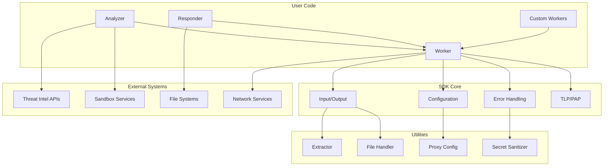
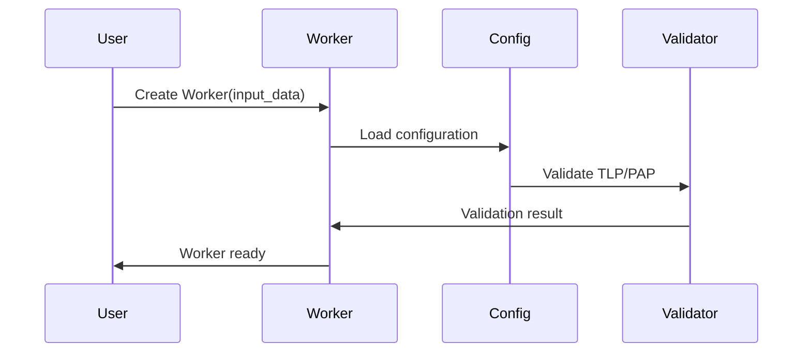
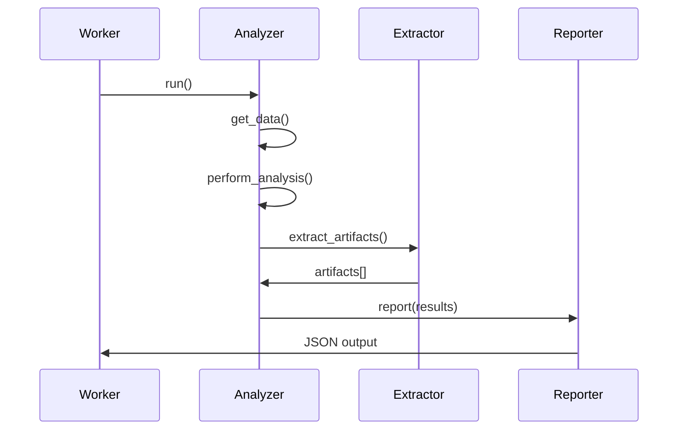
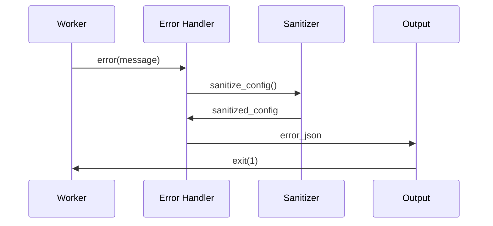

# Architecture Overview

This document provides a high-level overview of the SentinelIQ SDK architecture, design principles, and key components.

## Design Philosophy

The SentinelIQ SDK is built on several core principles:

### 1. **Simplicity First**
- Clean, intuitive API that's easy to learn and use
- Minimal configuration required for basic usage
- Clear separation of concerns

### 2. **Composition Over Inheritance**
- Modular design with composable components
- Protocol-based interfaces for flexibility
- Dependency injection for testability

### 3. **Security by Design**
- Built-in TLP/PAP enforcement
- Automatic secret sanitization
- Secure defaults and validation

### 4. **Performance Optimized**
- Zero external dependencies
- Efficient memory usage
- Async support for I/O operations

### 5. **Extensibility**
- Plugin architecture for custom functionality
- Hook-based customization points
- Clear extension patterns

## High-Level Architecture



## Core Components

### 1. Worker Base Class

The `Worker` class is the foundation of all SDK functionality:

```python
class Worker(ABC):
    """Common functionality for analyzers and responders."""
    
    def __init__(self, input_data: WorkerInput, secret_phrases: tuple[str, ...] | None = None):
        # Initialize worker with input data and configuration
    
    def get_data(self) -> Any:
        # Get observable data from input
    
    def get_param(self, name: str, default: Any = None, message: str | None = None) -> Any:
        # Access configuration parameters
    
    def error(self, message: str) -> NoReturn:
        # Handle errors with sanitization
    
    @abstractmethod
    def run(self) -> None:
        # Main worker logic (implemented by subclasses)
```

**Key Features:**
- Input validation and processing
- Configuration management
- Error handling with sanitization
- TLP/PAP enforcement
- Proxy configuration

### 2. Analyzer Class

Extends `Worker` with analyzer-specific functionality:

```python
class Analyzer(Worker):
    """Base class for analyzers with auto-extraction and helpers."""
    
    def get_data(self) -> Any:
        # Returns filename for files, data for other types
    
    def build_taxonomy(self, level: str, namespace: str, predicate: str, value: str) -> dict:
        # Create taxonomy entries
    
    def build_artifact(self, data_type: str, data: Any, **kwargs: Any) -> dict:
        # Create artifacts with file handling
    
    def artifacts(self, raw: Any) -> list[Artifact]:
        # Auto-extract IOCs when enabled
```

**Key Features:**
- File handling and processing
- Auto-extraction of IOCs
- Taxonomy classification
- Artifact generation
- Rich output format

### 3. Responder Class

Simplified `Worker` for response actions:

```python
class Responder(Worker):
    """Base class for responders."""
    
    def get_data(self) -> Any:
        # Returns data field from input
    
    def report(self, full_report: dict) -> ResponderReport:
        # Simplified output format
```

**Key Features:**
- Streamlined for response actions
- Minimal output format
- Focus on action execution

### 4. Extractor Utility

IOC detection using Python standard library:

```python
class Extractor:
    """Detect IOC attribute types using stdlib-backed heuristics."""
    
    def __init__(self, ignore: str | None = None):
        # Initialize with optional ignore string
    
    def check_string(self, value: str) -> str:
        # Check single string for IOC type
    
    def check_iterable(self, iterable: Any) -> list[ExtractorResult]:
        # Extract IOCs from data structures
```

**Supported Types:**
- IP addresses (IPv4/IPv6)
- URLs and domains
- File hashes (MD5/SHA1/SHA256)
- Email addresses
- Registry keys
- User agents

## Data Flow

### 1. Input Processing



### 2. Analysis Flow



### 3. Error Handling



## Configuration System

### 1. Input Data Structure

```python
@dataclass
class WorkerInput:
    data_type: str
    data: Any
    filename: str | None = None
    tlp: int = 2
    pap: int = 2
    config: WorkerConfig = field(default_factory=WorkerConfig)

@dataclass
class WorkerConfig:
    check_tlp: bool = True
    max_tlp: int = 2
    check_pap: bool = True
    max_pap: int = 2
    auto_extract: bool = True
    proxy: ProxyConfig = field(default_factory=ProxyConfig)
```

### 2. Configuration Access

```python
# Required parameter (exits if not found)
api_key = self.get_param("config.api_key", message="API key required")

# Optional parameter with default
timeout = self.get_param("config.timeout", default=30)

# Environment variable
debug_mode = self.get_env("DEBUG", default="false")
```

### 3. Proxy Configuration

```python
@dataclass
class ProxyConfig:
    http: str | None = None
    https: str | None = None
```

Automatically exported to environment variables:
- `http_proxy`
- `https_proxy`

## Security Model

### 1. TLP/PAP Enforcement

```python
def _validate_tlp_pap(self) -> None:
    """Validate TLP and PAP values against configured limits."""
    if self.enable_check_tlp and self.tlp > self.max_tlp:
        self.error("TLP is higher than allowed.")
    if self.enable_check_pap and self.pap > self.max_pap:
        self.error("PAP is higher than allowed.")
```

### 2. Secret Sanitization

```python
class SecretSanitizer:
    """Sanitize configuration entries in error payloads."""
    
    def sanitize(self, config: dict[str, Any], secret_phrases: tuple[str, ...]) -> dict[str, Any]:
        # Replace sensitive values with "REMOVED"
```

Default secret phrases: `key`, `password`, `secret`, `token`

### 3. Input Validation

```python
def _validate_observable(self, observable: str, data_type: str) -> bool:
    """Validate observable based on type."""
    if data_type == "ip":
        return self._is_valid_ip(observable)
    elif data_type == "url":
        return self._is_valid_url(observable)
    # ... other validations
```

## Extension Points

### 1. Custom Workers

```python
class CustomWorker(Worker):
    def run(self) -> None:
        # Implement custom logic
        pass
```

### 2. Plugin Architecture

```python
class PluginAnalyzer(Analyzer):
    def __init__(self, input_data):
        super().__init__(input_data)
        self.plugins = self._load_plugins()
    
    def _load_plugins(self) -> list:
        # Load custom plugins
        pass
```

### 3. Custom Extractors

```python
class CustomExtractor(Extractor):
    def _is_custom_type(self, value: str) -> bool:
        # Custom IOC detection logic
        pass
```

## Performance Considerations

### 1. Memory Management

- Zero external dependencies
- Efficient data structures
- Memory mapping for large files
- Garbage collection optimization

### 2. I/O Optimization

- Async support for network operations
- Chunked file processing
- Connection pooling
- Request batching

### 3. Caching

- Built-in caching for expensive operations
- Configurable TTL
- Memory-efficient storage
- Cache invalidation

## Testing Strategy

### 1. Unit Testing

```python
def test_analyzer():
    input_data = {"dataType": "ip", "data": "1.2.3.4"}
    analyzer = MyAnalyzer(input_data)
    
    with patch.object(analyzer, '_call_api') as mock_api:
        mock_api.return_value = {"verdict": "safe"}
        result = analyzer.report({"test": "success"})
        assert result["success"] is True
```

### 2. Integration Testing

```python
def test_full_workflow():
    # Test complete analysis workflow
    pass
```

### 3. Performance Testing

```python
def test_performance():
    # Test with large datasets
    pass
```

## Deployment Architecture

### 1. Standalone Mode

```bash
python my_analyzer.py
```

### 2. Job Directory Mode

```bash
python my_analyzer.py /job
```

### 3. STDIN Mode

```bash
echo '{"dataType": "ip", "data": "1.2.3.4"}' | python my_analyzer.py
```

### 4. Container Deployment

```dockerfile
FROM python:3.13-slim
COPY . /app
WORKDIR /app
RUN pip install sentineliqsdk
CMD ["python", "my_analyzer.py"]
```

## Monitoring and Observability

### 1. Logging

```python
import logging

logger = logging.getLogger(__name__)

def run(self):
    logger.info("Starting analysis")
    try:
        result = self._perform_analysis()
        logger.info("Analysis completed")
        self.report(result)
    except Exception as e:
        logger.error(f"Analysis failed: {e}")
        self.error(str(e))
```

### 2. Metrics

```python
def track_metrics(self):
    metrics = {
        "execution_time": time.time() - start_time,
        "memory_usage": psutil.Process().memory_info().rss,
        "api_calls": self.api_call_count
    }
    return metrics
```

### 3. Health Checks

```python
def health_check(self):
    return {
        "status": "healthy",
        "timestamp": time.time(),
        "version": sentineliqsdk.__version__
    }
```

## Future Considerations

### 1. Scalability

- Horizontal scaling support
- Load balancing
- Distributed processing
- Queue integration

### 2. Advanced Features

- Machine learning integration
- Real-time streaming
- Graph database support
- Advanced analytics

### 3. Ecosystem Integration

- SIEM integration
- SOAR platforms
- Cloud services
- API gateways

## Conclusion

The SentinelIQ SDK provides a solid foundation for building security automation tools. Its modular architecture, security-first design, and performance optimizations make it suitable for both simple scripts and complex enterprise systems.

The clear separation of concerns, comprehensive error handling, and extensive customization points ensure that developers can build robust, maintainable, and secure analyzers and responders.

For more detailed information, see the [API Reference](../reference/api/worker.md) and [Tutorials](../tutorials/building-analyzers.md).
